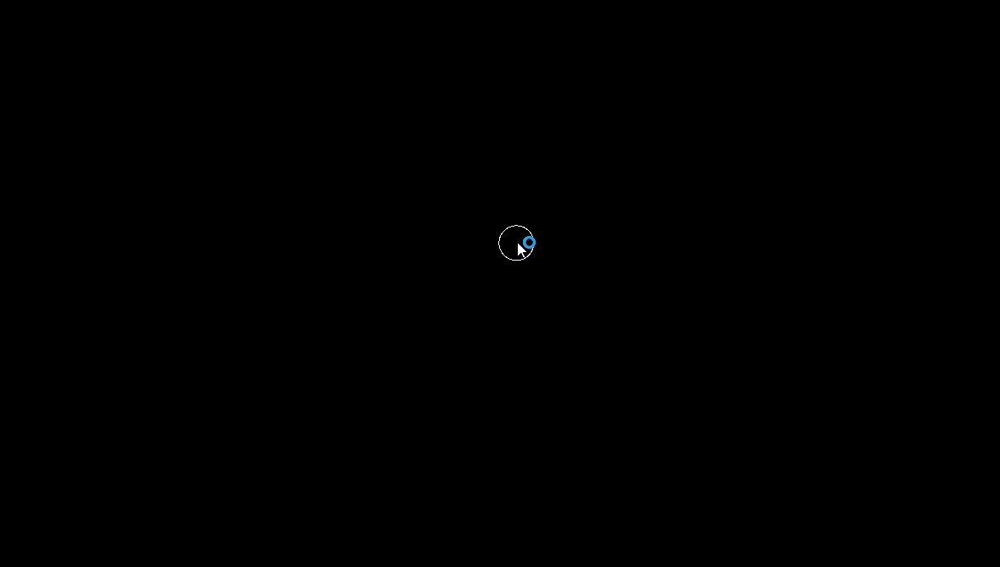

# 1.6 - Acceleration towards Mouse

Built with SFML, followed the book "The Nature Of Code - Daniel Shiffman".

By minipulating velocity using vector acceleration towords mouse position we can create a string like effect.

Project was made in 20/10/2022.
